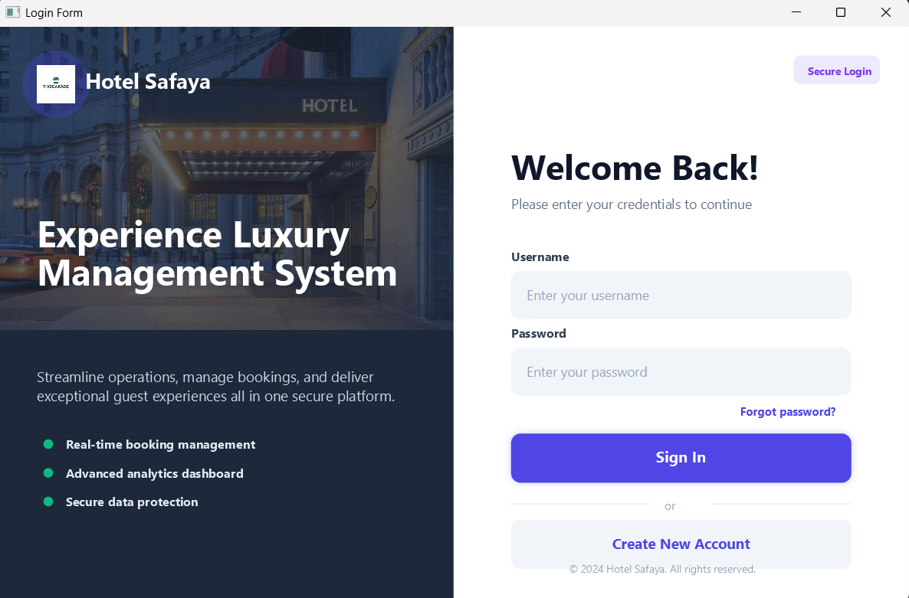
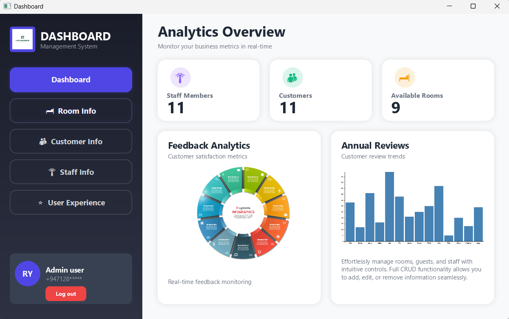

# 🏨 Hotel Management System

<div align="center">


**A Modern, Professional Hotel Operations Management Platform**

[Features](#-features) • [Installation](#-installation) • [Usage](#-usage) • [Screenshots](#-screenshots)

</div>

---

## 🌟 Overview

A comprehensive hotel management desktop application built with **JavaFX**, featuring an intuitive user interface and complete **CRUD operations** for managing rooms, customers, staff, and guest experiences. This system streamlines hotel operations with real-time analytics, secure authentication, and efficient data management.

### Why This Project?

- ✅ Modern, responsive UI with professional design
- ✅ Complete CRUD operations for all modules
- ✅ Real-time analytics dashboard
- ✅ Secure authentication system
- ✅ Easy to customize and extend

---

## 🛠️ Technologies Used

<table>
<tr>
<td align="center" width="200">

<br><b>Java 11+</b>
</td>
<td align="center" width="200">

<br><b>JavaFX</b>
</td>
<td align="center" width="200">

<br><b>MySQL</b>
</td>
</tr>
<tr>
<td align="center" width="200">

<br><b>FXML</b>
</td>
<td align="center" width="200">

<br><b>CSS3</b>
</td>
<td align="center" width="200">

<br><b>MVC Pattern</b>
</td>
</tr>
</table>

---

## 📦 Installation

### Step 1: Clone the Repository

```bash
git clone https://github.com/yourusername/hotel-management-system.git
cd hotel-management-system
```

### Step 2: Configure Database

Create MySQL database and import schema:

```sql
CREATE DATABASE hotel_management;
USE hotel_management;
SOURCE database/schema.sql;
```

Update database configuration in `config.properties`:

```properties
db.url=jdbc:mysql://localhost:3306/hotel_management
db.username=root
db.password=your_password
```

### Step 3: Build the Project

**Using Maven:**
```bash
mvn clean install
```


### Step 4: Run the Application

```bash
java --module-path /path/to/javafx-sdk/lib \
     --add-modules javafx.controls,javafx.fxml \
     -jar target/HotelManagement.jar
```

---

## 🚀 Usage

### Default Login Credentials

```
Username: Admin
Password: 1234
```

> ⚠️ **Important:** Change the default password after first login!

## 📁 Project Structure

```
hotel-management-system/
│
├── src/
│   ├── main/
│   │   ├── java/
│   │   │   ├── controller/
│   │   │   │   ├── DashboardController.java
│   │   │   │   ├── LoginFormController.java
│   │   │   │   ├── SignUpController.java
│   │   │   │   ├── RoomInfoController.java
│   │   │   │   ├── CustomerInfoController.java
│   │   │   │   └── StaffController.java
│   │   │   │
│   │   │   ├── model/
│   │   │   │   ├── User.java
│   │   │   │   ├── Room.java
│   │   │   │   ├── Customer.java
│   │   │   │   └── Staff.java
│   │   │   │
│   │   │   ├── service/
│   │   │   │   ├── RoomService.java
│   │   │   │   ├── CustomerService.java
│   │   │   │   └── StaffService.java
│   │   │   │
│   │   │   ├── util/
│   │   │   │   ├── DatabaseConnection.java
│   │   │   │   ├── ValidationHelper.java
│   │   │   │   └── AlertHelper.java
│   │   │   │
│   │   │   └── Main.java
│   │   │
│   │   └── resources/
│   │       ├── fxml/
│   │       │   ├── Dashboard.fxml
│   │       │   ├── LoginForm.fxml
│   │       │   ├── SignUpForm.fxml
│   │       │   ├── RoomInfo.fxml
│   │       │   ├── CustomerInfo.fxml
│   │       │   └── StaffInfo.fxml
│   │       │
│   │       ├── css/
│   │       │   └── styles.css
│   │       │
│   │       └── images/
│   │           ├── logo.png
│   │           ├── hotel-bg.jpg
│   │           └── icons/
│   │
│   └── test/
│       └── java/
│           └── (test files)
│
├── database/
│   ├── schema.sql
│   └── sample-data.sql
│
├── lib/
│   └── (external libraries)
│
├── config.properties
├── pom.xml (or build.gradle)
├── README.md
└── LICENSE
```

---

## 🗄️ Database Schema

### Users Table
```sql
CREATE TABLE users (
    user_id INT PRIMARY KEY AUTO_INCREMENT,
    username VARCHAR(50) UNIQUE NOT NULL,
    password VARCHAR(255) NOT NULL,
    phone_number VARCHAR(15),
    created_at TIMESTAMP DEFAULT CURRENT_TIMESTAMP
);
```

### Rooms Table
```sql
CREATE TABLE rooms (
    room_id VARCHAR(10) PRIMARY KEY,
    room_type VARCHAR(50) NOT NULL,
    price DECIMAL(10,2) NOT NULL,
    description TEXT,
    status ENUM('Available', 'Occupied', 'Maintenance') DEFAULT 'Available'
);
```

### Customers Table
```sql
CREATE TABLE customers (
    customer_id VARCHAR(10) PRIMARY KEY,
    name VARCHAR(100) NOT NULL,
    telephone VARCHAR(15) NOT NULL,
    age INT,
    city VARCHAR(50)
);
```

### Staff Table
```sql
CREATE TABLE staff (
    staff_id VARCHAR(10) PRIMARY KEY,
    name VARCHAR(100) NOT NULL,
    telephone VARCHAR(15) NOT NULL,
    email VARCHAR(100),
    role ENUM('Manager', 'Receptionist', 'Housekeeping') NOT NULL,
    salary DECIMAL(10,2) NOT NULL
);
```

---

## 📸 Screenshots

<table align="center">
  <tr>
    <td align="center">
      <strong>Login Screen</strong><br>
      
    </td>
    <td align="center">
      <strong>Dashboard</strong><br>
      
    </td>
  </tr>
</table>


---

## 📄 License

Distributed under the MIT License. See `LICENSE` file for more information.

```
MIT License

Copyright (c) 2024 Rishindu Yohan

Permission is hereby granted, free of charge, to any person obtaining a copy
of this software and associated documentation files (the "Software"), to deal
in the Software without restriction...
```
---

## 🙏 Acknowledgments

- [JavaFX Documentation](https://openjfx.io/)
- [MySQL Documentation](https://dev.mysql.com/doc/)

---

